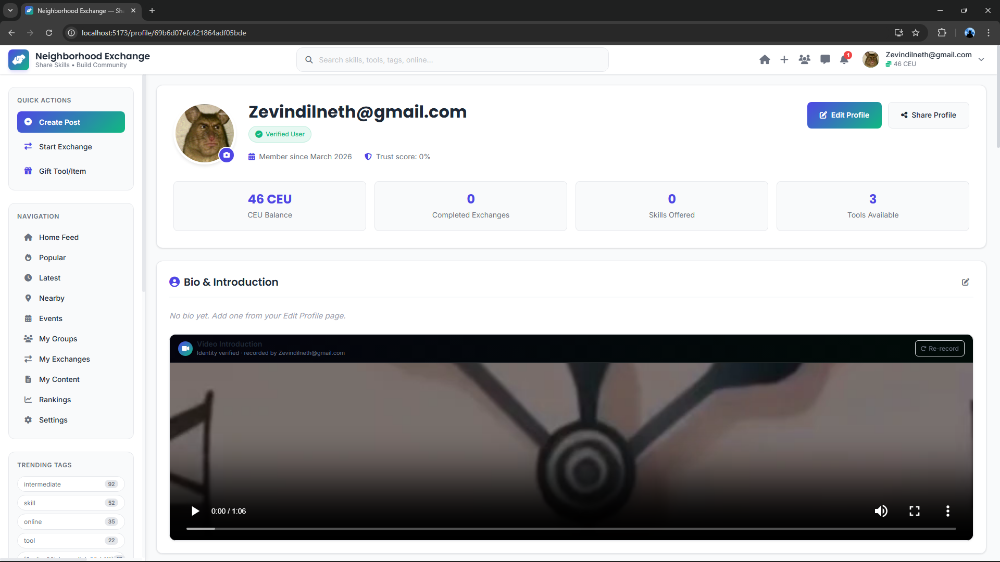
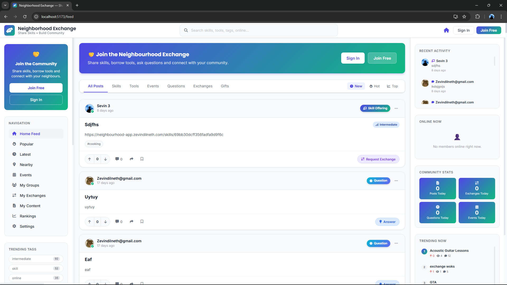
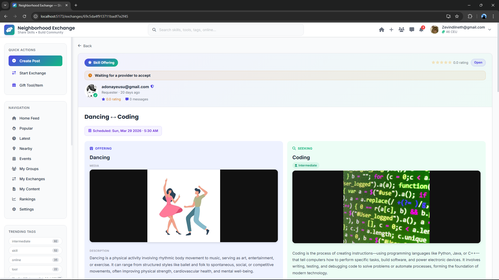
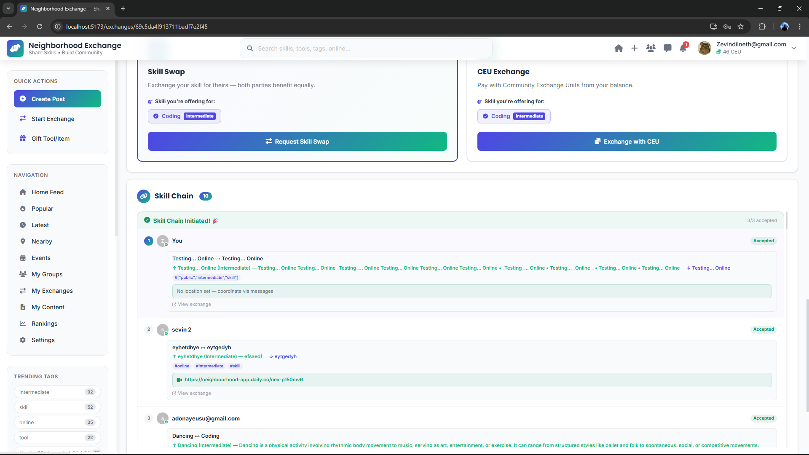
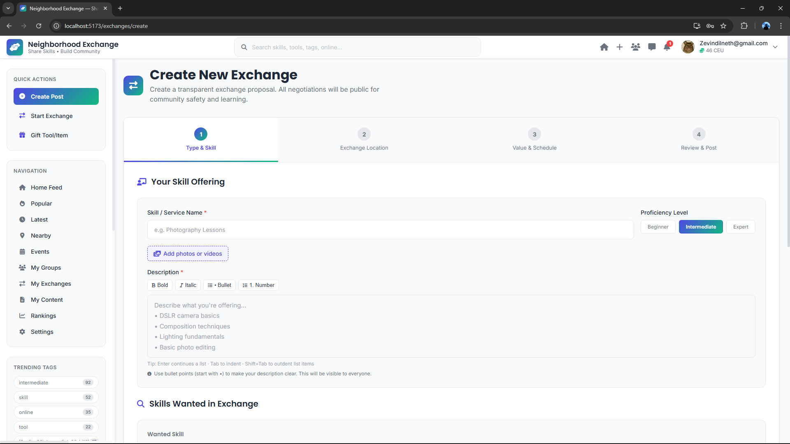
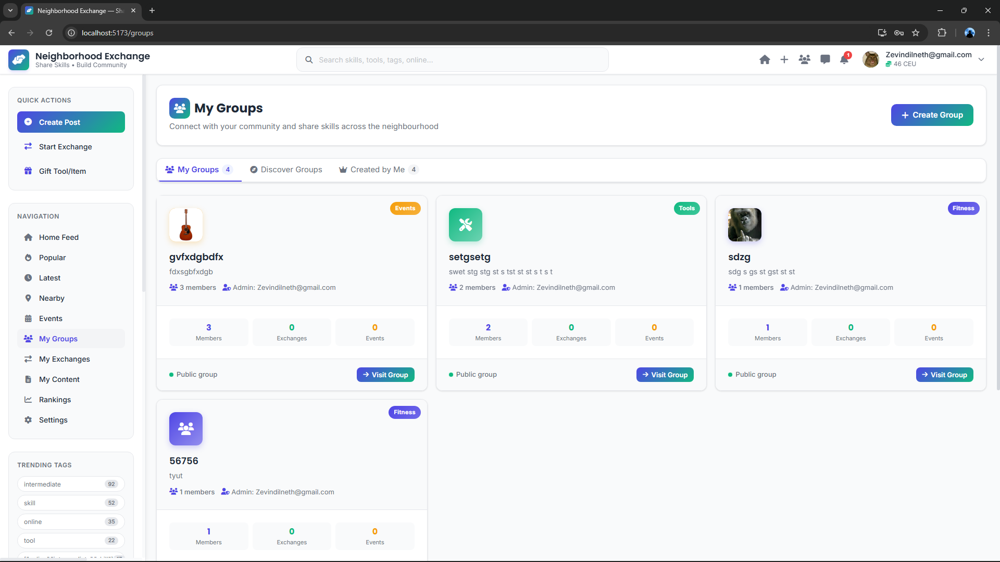
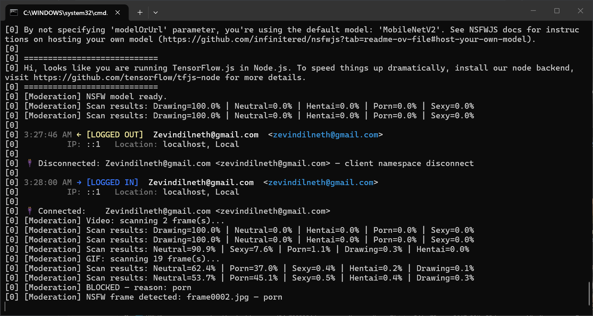

# 🏘️ Neighbourhood Exchange Platform

The **Neighbourhood Exchange Platform** is a community-focused web application that solves the classic "double coincidence of wants" problem in barter economies. Rather than requiring two people to each want exactly what the other offers, the platform uses a **Skill Chain Engine** (directed graph cycle detection) to discover circular exchanges among 3–5 users, and a **CEU economy** to enable fair multi-modal trades between skills, tool loans, and gifts.

The platform's **TF-IDF Cosine-Similarity Interest Engine** matches users across three dimensions (title, tags, description) to surface the most relevant skill and tool opportunities nearby. Every exchange is scored by a **Fairness Calculator** (ratio = 1 − |CEU_A − CEU_B| / max, with ≥0.8 = fair, 0.7–0.8 = needs adjustment, <0.7 = unfair), ensuring equitable community exchange.

Built on a MERN-style stack — **React 18 + TypeScript + Vite** with **Material-UI**, **Mapbox GL**, and **Socket.IO** on the frontend; **Node.js + Express + TypeScript** on the backend; **MongoDB Atlas** with geospatial indexes, **Redis** for caching and real-time scaling, **AWS S3** for file storage, and **SendGrid** for email.

---

## Table of Contents

- [Features](#features)
- [Screenshots](#screenshots)
- [System Architecture](#system-architecture)
- [Core Algorithms](#core-algorithms)
- [Technology Stack](#technology-stack)
- [Project Structure](#project-structure)
- [Data Models](#data-models)
- [Performance](#performance)
- [AI Content Moderation](#ai-content-moderation-nsfw-detection)
- [Security](#security)
- [Getting Started](#getting-started)
- [Testing](#testing)
- [Docker](#docker)
- [Estimated Monthly Costs](#estimated-monthly-costs-mvp)
- [Roadmap](#roadmap)
- [Project Documentation](#project-documentation)
- [Author](#author)

---

## Features

- **Skill Exchange** — 1-to-1, group (one facilitator, multiple learners), and multi-user chain exchanges
- **Tool & Resource Sharing** — Borrow, lend, or gift tools with CEU-based pricing and condition tracking
- **Community Q&A Forum** — Reddit-style forum with CEU bounties, voting, and expert verification
- **Interactive Map** — Mapbox-powered neighbourhood map with real-time listings and geospatial search
- **CEU Economy** — Unified currency for all exchange types with full transaction history
- **Skill Chain Engine** — Directed-graph algorithm discovering circular exchanges of length 2–5
- **Fairness Calculator** — Algorithmic exchange scoring with actionable adjustment suggestions
- **Rankings & Reputation** — 6-category scoring with Bronze → Silver → Gold → Diamond tiers
- **Real-time Messaging** — Socket.IO chat with Redis adapter for horizontal scaling
- **Community Events** — Workshop and meetup creation with RSVP and Q&A integration
- **AI Content Moderation** — TensorFlow.js + NSFWJS for automated image and video safety
- **JWT Authentication** — Access + refresh token rotation with bcrypt (factor 12) hashing

---

## Screenshots

### Dashboard



*User dashboard showing CEU balance, ranking tiers, recent activity, nearby opportunities, and a 7-day CEU activity chart.*

### Discover — Skills & Tools



*Discovery grid with filterable skill and tool cards showing distance, proficiency level, star rating, and CEU rate.*

### Exchange Detail



*Active 1-to-1 exchange view: Guitar Lessons ↔ Spanish Tutoring — showing fairness score, session history, CEU flow, and messaging.*

### Skill Chain Engine



*Multi-user circular exchange visualiser — 4-user active chain and a 3-user pending suggestion with probability score and fairness metric.*

### Community Q&A Forum



*Reddit-style Q&A with CEU bounties, urgency flags, category filtering, and a live leaderboard of top community helpers.*

### Interactive Map View



*Mapbox neighbourhood map with real-time skill and tool pins, distance radius overlay, and category filter panel.*

### Community Rankings


*Multi-category leaderboard with podium view, ranking formula, and tier thresholds (Bronze 0–99 → Diamond 500+).*

### AI Content Moderation



*Live server output — NSFW model scanning uploads frame by frame and blocking flagged content in real time.*

---

## System Architecture

```
+----------------------------------------------------------+
|                      CLIENT LAYER                        |
|   React 18 + TypeScript + Vite + MUI + Mapbox GL        |
|   Socket.IO Client  |  React Query  |  Axios  |  Turf.js |
+----------------------------------------------------------+
                            |  HTTPS / WebSocket
                            v
+----------------------------------------------------------+
|                   API GATEWAY LAYER                      |
|       Load Balancer  +  Rate Limiter  +  JWT Auth        |
+----------------------------------------------------------+
                            |
                            v
+----------------------------------------------------------+
|               SERVICE LAYER  (Node.js + Express)         |
|  User | Exchange | Q&A | Ranking | Matching | Messaging  |
|  Events | Notifications | Moderation | Chain Engine      |
+----------------------------------------------------------+
                            |
                            v
+----------------------------------------------------------+
|                      DATA LAYER                          |
|  MongoDB Atlas  (primary + replica, 2dsphere index)      |
|  Redis          (cache, Socket.IO adapter, Bull queues)  |
|  AWS S3         (user uploads, private ACL, signed URLs) |
+----------------------------------------------------------+
                            |
                            v
+----------------------------------------------------------+
|                  EXTERNAL SERVICES                       |
|  Mapbox API  |  SendGrid  |  Twilio SMS  |  Daily.co     |
|  TensorFlow.js + NSFWJS  |  Google Analytics             |
+----------------------------------------------------------+
```

---

## Core Algorithms

### 1. CEU Calculation

```
Skill Value     = Hours x SkillMultiplier x ProficiencyLevel
SkillMultiplier = Base(1.0) + RarityBonus + DemandBonus
Proficiency     = Beginner(0.8) | Intermediate(1.0) | Expert(1.5)

Tool Borrowing  = (MarketValue x 0.001 x Days) + RiskFactor
Tool Gifting    = MarketValue x 1.2   (generosity bonus)

Q&A Answer      = Base(5) + Upvotes(x1) + AcceptedBonus(20) + BountyShare
```

### 2. Fairness Calculator

```
ratio = 1 - |CEU_A - CEU_B| / max(CEU_A, CEU_B)

ratio >= 0.8        ->  Fair match
0.7 <= ratio < 0.8  ->  Needs minor adjustment
ratio < 0.7         ->  Unfair — platform suggests specific top-ups
```

### 3. Skill Chain Engine

```
1. Build directed graph: nodes = users, edges = compatible offers
2. Run DFS cycle detection for cycles of length 2-5
3. Score each chain: CEU fairness, skill match, proximity, rating
4. Rank by: fairness(0.4) x skill_match(0.3) x proximity(0.3)
5. Propose top chains with expected success probability
6. Track completion rates to improve future recommendations
```

### 4. Interest Engine (TF-IDF Cosine Similarity)

```
Similarity = cosine(TF-IDF(user_profile), TF-IDF(listing))

Computed across 3 dimensions:
  dim1: title overlap
  dim2: tag intersection
  dim3: description keyword matching
```

### 5. Ranking Calculation

```
Overall Score = Sum(CategoryScore x Weight)

  Skill Exchange:      25%
  Tool Sharing:        20%
  Q&A Participation:   20%
  Community Building:  15%
  Chain Success:       10%
  Fairness History:    10%

Tiers: Bronze(0-99) | Silver(100-249) | Gold(250-499) | Diamond(500+)
```

---

## Technology Stack

### Frontend

| Technology | Version | Purpose |
|---|---|---|
| React | 18.2.0 | Component-based UI with Concurrent features |
| TypeScript | 4.9.5 | Static typing across the full stack |
| Vite | 4.0.0 | Build tool (~50-80% faster than CRA) |
| Material-UI (MUI) | 5.11.0 | Accessible, responsive component library |
| React Query | 4.0.0 | Server state with 30-second stale cache |
| Mapbox GL JS | 2.13.0 | Interactive neighbourhood map |
| Turf.js | 6.5.0 | Geospatial analysis and distance buffering |
| Socket.IO Client | 4.6.0 | Real-time bidirectional messaging |
| React Router DOM | 6.8.0 | Declarative nested routing |
| Axios | 1.3.0 | HTTP client with JWT interceptors |

### Backend

| Technology | Version | Purpose |
|---|---|---|
| Node.js | 18.12.1 LTS | Non-blocking I/O runtime |
| Express.js | 4.18.2 | RESTful API framework |
| TypeScript | 4.9.5 | Backend type safety |
| Mongoose | 6.8.3 | MongoDB ODM with schema validation |
| Socket.IO | 4.6.0 | WebSocket server with rooms |
| Redis | 4.6.0 | Caching, sessions, rate limiting |
| Bull | 4.10.4 | Redis-backed background job queues |
| Multer | 1.4.5 | File upload handling (5 MB limit) |
| Sharp | 0.31.3 | Image resizing to WebP (80% quality) |
| jsonwebtoken | 9.0.0 | JWT (15-min access + refresh tokens) |
| bcryptjs | 2.4.3 | Password hashing (work factor 12) |
| Helmet | 7.0.0 | HTTP security headers (CSP, HSTS) |
| Joi | 17.8.0 | Schema-based request validation |
| sanitize-html | 2.8.1 | XSS input sanitisation |

### Infrastructure & Services

| Component | Technology |
|---|---|
| Primary Database | MongoDB Atlas (replica set, 2dsphere index) |
| Cache | Redis 7 (< 50ms geospatial queries, ~85% hit rate) |
| File Storage | AWS S3 eu-north-1 (private ACL, signed URLs) |
| Email | SendGrid (dynamic templates) |
| Mapping | Mapbox API |
| Video Calls | Daily.co |
| SMS Verification | Twilio |
| Content Moderation | TensorFlow.js + NSFWJS (MobileNetV2) |
| Containerisation | Docker + docker-compose |
| Frontend Hosting | Vercel |
| Backend Hosting | Railway |

---

## Project Structure

```
neighbourhood-exchange-platform/
|-- client/                       # React 18 + TypeScript frontend
|   |-- src/
|   |   |-- components/           # Reusable MUI components
|   |   |-- pages/                # Route-level pages
|   |   |   |-- Dashboard/
|   |   |   |-- Discover/
|   |   |   |-- Exchange/
|   |   |   |-- QAForum/
|   |   |   |-- MapView/
|   |   |   |-- Events/
|   |   |   `-- Rankings/
|   |   |-- hooks/                # Custom React hooks
|   |   |-- context/              # React Context + useReducer
|   |   |-- services/             # Axios API client modules
|   |   `-- utils/
|   `-- package.json
|
|-- server/                       # Node.js + Express + TypeScript API
|   |-- src/
|   |   |-- models/               # Mongoose schemas
|   |   |   |-- User.ts
|   |   |   |-- Exchange.ts
|   |   |   |-- Chain.ts
|   |   |   |-- Post.ts
|   |   |   `-- Transaction.ts
|   |   |-- routes/               # Express route handlers
|   |   |-- services/
|   |   |   |-- skillChainEngine.ts    # DFS graph cycle detection
|   |   |   |-- interestEngine.ts      # TF-IDF cosine similarity
|   |   |   |-- fairnessCalculator.ts  # CEU fairness scoring
|   |   |   |-- ceuCalculator.ts       # CEU value computation
|   |   |   `-- moderation.ts          # TensorFlow.js + NSFWJS
|   |   |-- middleware/           # Auth, rate limit, validation
|   |   |-- sockets/              # Socket.IO event handlers
|   |   `-- index.ts
|   `-- package.json
|
|-- docker-compose.yml
|-- package.json
|-- .env.example
`-- README.md
```

---

## Data Models

13 MongoDB collections:

| Collection | Description |
|---|---|
| `users` | Profile, CEU balance, Bronze-Diamond rankings, GeoJSON location |
| `skill_listings` | Offered/wanted skills with proficiency and availability |
| `tool_listings` | Tools for borrow/lend/gift with condition and CEU/day rate |
| `exchanges` | 1-to-1, group, or chain agreements with fairness score |
| `chains` | Multi-user circular exchange sequences (2-5 users) |
| `qa_posts` | Questions, answers, discussions with bounties and voting |
| `events` | Community workshops and meetups with GeoJSON location |
| `messages` | Real-time chat linked to exchanges |
| `reviews` | Post-exchange ratings (1-5 stars + fairness rating) |
| `transactions` | CEU movement log (earn / spend / bounty / penalty) |
| `moderation_logs` | Content moderation audit trail |
| `notifications` | User notification records |
| `analytics` | Platform usage and engagement data |

---

## Performance

| Metric | Target | Result |
|---|---|---|
| Page load (95th percentile) | < 3s | ~2.4s (code-split bundles) |
| Geospatial query (10k docs) | < 100ms | < 50ms (2dsphere index) |
| Real-time message latency | < 500ms | < 100ms local |
| Redis cache hit rate | > 80% | ~85% |
| Concurrent Socket.IO connections | 10,000+ | Yes (Redis adapter) |
| Uptime SLA | 99.5% | Yes (MongoDB Atlas + CDN) |

---

## AI Content Moderation (NSFW Detection)

Every uploaded image, video, and GIF is automatically scanned server-side using **TensorFlow.js** and **NSFWJS** (MobileNetV2 model) before it is stored or shown to any user.

### Classification

Each frame is scored across 5 categories. If `Porn` or `Hentai` exceeds the threshold on any frame, the entire upload is rejected before reaching AWS S3.

| Category | Description |
|---|---|
| `Neutral` | Safe, everyday content |
| `Drawing` | Illustrations, artwork, diagrams |
| `Sexy` | Suggestive but not explicit |
| `Porn` | Explicit sexual content — **blocked** |
| `Hentai` | Animated explicit content — **blocked** |

### Real Output From the Running Server

```
[Moderation] NSFW model ready.
[Moderation] Scan results: Drawing=100.0% | Neutral=0.0% | Hentai=0.0% | Porn=0.0%  | Sexy=0.0%
[Moderation] Video: scanning 2 frame(s)...
[Moderation] Scan results: Neutral=90.9% | Sexy=7.6%   | Porn=1.1%   | Drawing=0.3% | Hentai=0.0%
[Moderation] GIF:   scanning 19 frame(s)...
[Moderation] Scan results: Neutral=53.7% | Porn=45.1%  | Sexy=0.5%   | Hentai=0.4% | Drawing=0.3%
[Moderation] BLOCKED — reason: porn
[Moderation] NSFW frame detected: frame0002.jpg — porn
```

### Implementation

```typescript
const predictions = await model.classify(imageTensor);
const pornScore   = predictions.find(p => p.className === 'Porn')?.probability   ?? 0;
const hentaiScore = predictions.find(p => p.className === 'Hentai')?.probability ?? 0;

if (pornScore > 0.4 || hentaiScore > 0.4) {
  throw new Error(`NSFW content detected — reason: ${pornScore > hentaiScore ? 'porn' : 'hentai'}`);
}
```

All scan decisions are written to the `moderation_logs` collection for admin audit.

---

## Security

- **JWT** access tokens (15-min expiry) with refresh token rotation
- **bcrypt** password hashing (work factor 12)
- **Helmet** HTTP security headers (CSP, HSTS, X-Frame-Options)
- **express-rate-limit** — 100 requests per 15 minutes per IP
- **sanitize-html** — XSS prevention on all user-generated content
- **AI content moderation** — NSFW uploads blocked before storage
- **AWS S3 private ACL** — all uploads require signed URLs
- **HTTPS** enforced everywhere with HSTS
- **GDPR / UK Data Protection Act 2018** compliant

---

## Getting Started

> All API keys are pre-configured. Free trial services valid until approximately June 2026 (AWS free tier). First install downloads approximately 2.5 GB of node_modules.

### Prerequisites

- Node.js 18+ and npm
- Git

### Install and Run

```bash
# 1. Clone the repository
git clone https://github.com/yourusername/neighbourhood-exchange-platform.git
cd neighbourhood-exchange-platform

# 2. Install all dependencies
npm install
cd client && npm install
cd ../server && npm install
cd ..

# 3. Start development servers
npm run dev
```

| Service | URL |
|---|---|
| Frontend | http://localhost:5173 |
| Backend API | http://localhost:3001 |

### Environment Variables

Copy `.env.example` to `.env` in the `server/` folder:

```env
NODE_ENV=development
PORT=5000
CLIENT_URL=http://localhost:5173
MONGODB_URI=mongodb+srv://<user>:<pass>@<cluster>.mongodb.net/neighbourhood_exchange
REDIS_URL=redis://default:<pass>@<host>:<port>
JWT_SECRET=your_64_char_random_hex
JWT_REFRESH_SECRET=your_different_64_char_hex
MAPBOX_ACCESS_TOKEN=pk.your_mapbox_token
AWS_ACCESS_KEY=your_aws_key
AWS_SECRET_KEY=your_aws_secret
AWS_REGION=eu-north-1
AWS_S3_BUCKET=your-bucket-name
SMTP_USER=your@gmail.com
SMTP_PASS=your_16_char_app_password
TWILIO_ACCOUNT_SID=ACxxxxxxxxxxxxxxxx
TWILIO_AUTH_TOKEN=your_twilio_token
DAILY_API_KEY=your_daily_api_key
```

---

## Testing

```bash
npm test                 # All tests
cd client && npm test    # Frontend (React Testing Library + Jest)
cd server && npm test    # Backend API (Supertest + Jest)
npm run test:coverage    # Coverage report
```

Coverage targets: 85% branches — 80% functions — 80% lines

---

## Docker

```bash
docker-compose up -d       # Start MongoDB + Redis + API
docker-compose logs -f api # View logs
```

---

## Estimated Monthly Costs (MVP)

| Service | Cost |
|---|---|
| Mapbox | $0 – $50 |
| MongoDB Atlas | $0 – $57 (M0 free to M10) |
| AWS S3 | $0 – $5 |
| SendGrid | $0 (100 emails/day free) |
| Vercel / Railway | $0 – $20 |
| **Total** | **$0 – $132 / month** |

---

## Roadmap

**Phase 2**

- iOS and Android native apps (React Native)
- Integrated video calling for remote exchanges
- Advanced community impact analytics
- Optional premium features (visibility boosts, expert consultations)

**Phase 3**

- Machine learning enhancements to the matching algorithm
- Advanced gamification mechanics
- Multi-language (i18n) support
- Public API for third-party integrations
- Community governance with democratic feature voting

---

## Project Documentation

| Document | Description |
|---|---|
| `SOFTWARE REQUIREMENTS SPECIFICATION.pdf` | Full SRS — 11 functional + 6 non-functional requirement groups |
| `4.1.1 Technology Stack & Libraries.txt` | Tech justification with benchmarks |
| `Database Schema Relationships.txt` | 13-collection MongoDB schema with entity relationships |
| `Architecture/` | System, deployment, auth flow, and data-flow diagrams |
| `NEP_Test_Cases.xlsx` | Complete test case matrix |
| `Ranking Calculation Algorithm.xlsx` | Ranking formula workbook |
| `CI6600_Final Individual Project_...pdf` | Full project report submitted for CI6600 |

